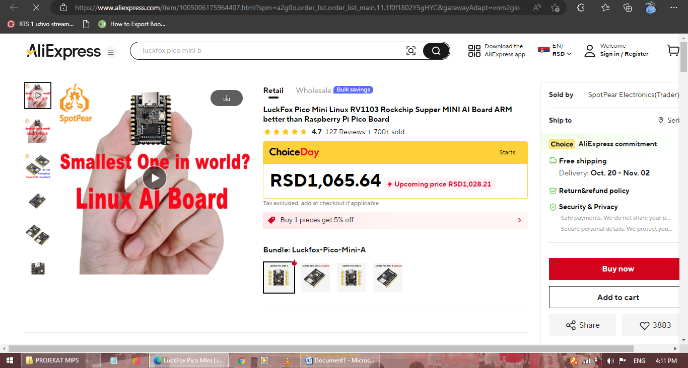
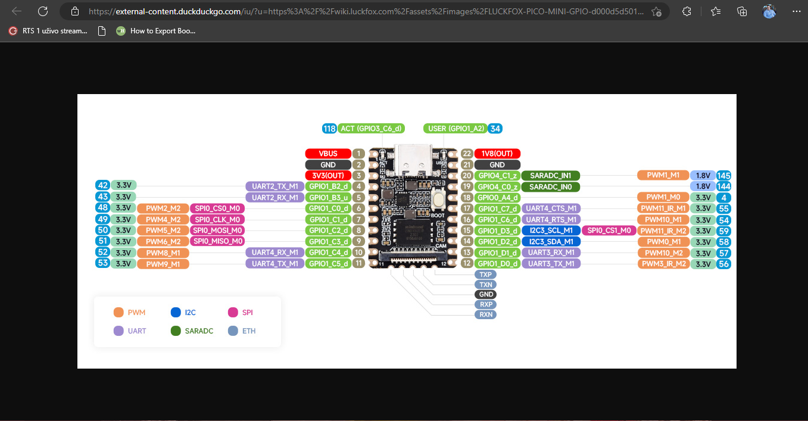
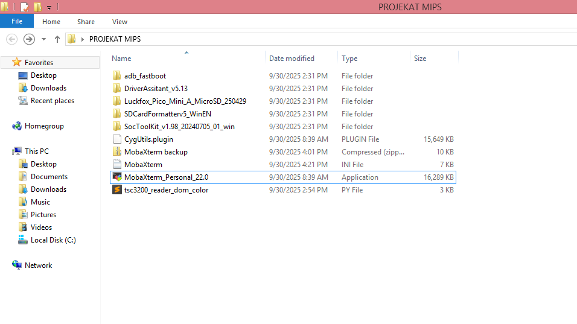
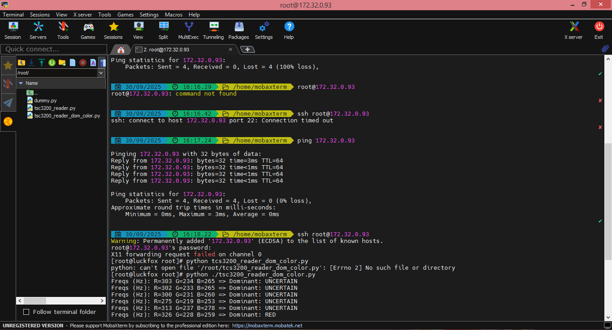
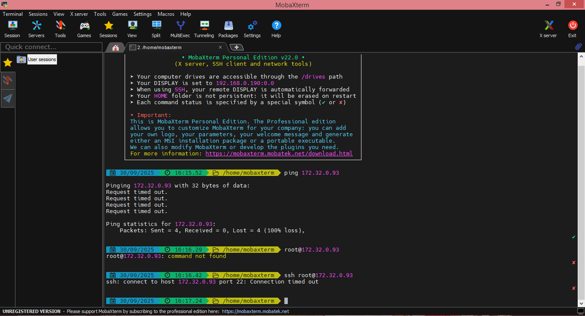

# Projekat: Detekcija boje pomoću GY-31 TCS3200 senzora i LuckFox Pico Mini AI Board

**Autor:** Dušan Filipović  
**Broj indeksa:** 88-2020  
**Predmet:** Mikroprocesorski sistemi  

---

## Uvod

Ovaj projekat koristi GY-31 TCS3200 senzor boje i LuckFox Pico Mini Linux AI Board za detekciju boje objekta. Senzor meri intenzitet crvene, zelene i plave komponente svetlosti reflektovane od objekta, a rezultate šalje mikrokontroleru radi daljeg obrade.

---

## Popis neophodnih komponenti

| Komponenta                                        | Opis / Link                                      |
|---------------------------------------------------|--------------------------------------------------|
| GY-31 TCS3200 senzor boje                         | Modul za detekciju boje, [datasheet](https://www.mouser.com/datasheet/2/813/TCS3200-1125170.pdf) |
| LuckFox Pico Mini AI Board                        | ARM Linux board, [AliExpress link](https://www.aliexpress.com/item/1005006175964407.html) [LuckFox Wiki](https://wiki.luckfox.com/) |
| MicroSD kartica (min 8GB, preporučeno 16GB)       | Za OS i fajlove                                  |
| USB kabl (Type-C ili MicroUSB, zavisno od boarda) | Za napajanje i komunikaciju                      |
| Žice za povezivanje (male "dupont" kablovi)       | Za spajanje senzora sa boardom                   |
| Računar sa Windows OS                             | Priprema SD kartice, instalacija drajvera, SSH   |
| SD Card Formatter (opciono)                       | [SDCardFormatter](https://www.sdcard.org/downloads/formatter/) |
| SocToolKit za flashovanje image-a                 | [LuckFox Toolkit](https://wiki.luckfox.com/en/tools.html) |
| Driver Assistant za USB-Ethernet                  | [DriverAssistant](https://wiki.luckfox.com/en/tools.html) |
| MobaXterm (SSH klijent)                           | [MobaXterm](https://mobaxterm.mobatek.net/)      |
| python-periphery biblioteka                       | [python-periphery](https://github.com/vsergeev/python-periphery) |
| Breadboard (opciono, za lakše povezivanje)        |                                                  |

---

## Korišćeni hardver

- **GY-31 TCS3200 senzor boje**  
  Senzor se sastoji od TCS3200 čipa, fotodiodne mreže sa filterima za crvenu, zelenu i plavu, i četiri LED diode za osvetljavanje objekta.  
  Modul se povezuje preko sledećih pinova:
  - VCC – napajanje (3.3V ili 5V)
  - GND – masa
  - S0, S1 – izbor frekvencije izlaznog signala (skaling output frequency)
  - S2, S3 – izbor aktivnog filtera (R, G, B ili clear)
  - OUT – digitalni izlaz (frekvencija zavisi od intenziteta boje)
  - LED – uključivanje/isključivanje LED dioda

- **LuckFox Pico Mini Linux AI Board**  
  Mini Linux ARM board, pogodan za AI projekte, sa podrškom za povezivanje različitih senzora.  
  

---

## Povezivanje senzora sa LuckFox Pico Mini AI Board

Senzor GY-31 TCS3200 se povezuje sa LuckFox Pico Mini AI Board koristeći žičane veze prema sledećoj šemi:

| TCS3200 Pin | Funkcija  | Pin na boardu      | Broj pina |
|-------------|-----------|--------------------|-----------|
| VCC         | Napajanje | 3V3(OUT)           | 3         |
| GND         | Masa      | GND                | 2 / 21    |
| S0          | Skaliranje| GPIO1_B3_u         | 5         |
| S1          | Skaliranje| GPIO1_C2_d         | 8         |
| S2          | Filter    | GPIO1_C3_d         | 9         |
| S3          | Filter    | GPIO1_C4_d         | 10        |
| OUT         | Izlaz     | GPIO1_D1_d         | 13        |

Raspored pinova na LuckFox Pico Mini AI Board-u:



Za povezivanje se koriste standardne žice za breadboard, a svaka funkcija senzora je spojena na odgovarajući GPIO pin na board-u.

---

## Priprema i instalacija sistema

### 1. Priprema SD kartice i instalacija Linux-a

- Preuzeti pre-built Linux image:  
  `Luckfox_Pico_Mini_A_MicroSD_250429/`  
  (Skinuti sa zvaničnog LuckFox drive-a)

- ### Formatiranje SD kartice 

Pre flešovanja Linux image-a na SD karticu, preporučuje se da se kartica formatira radi pouzdanijeg rada sistema.  
Ako kartica nije pravilno formatirana, mogu se pojaviti problemi tokom snimanja image-a, pokretanja sistema ili prepoznavanja kartice od strane LuckFox Pico Mini board-a.

**Postupak:**

1. SD karticu je potrebno ubaciti u računar (preporučuje se korišćenje adaptera).
2. Treba preuzeti i otvoriti aplikaciju SD Card Formatter ([zvanični link](https://www.sdcard.org/downloads/formatter/)).
3. U aplikaciji je potrebno odabrati željenu karticu i odabrati „Quick Format“ ili „Overwrite Format“ opciju.
4. Formatiranje treba potvrditi klikom na „Format“.  
   Nakon završetka formatiranja, kartica je spremna za snimanje Linux image-a.

---

**Tipične greške ako kartica nije formatirana:**
- SocToolKit prijavljuje grešku pri snimanju image-a.
- Board ne prepoznaje SD karticu ili ne podiže operativni sistem.
- Fajlovi na kartici su oštećeni.

---

Formatiranjem SD kartice se obezbeđuje čisto stanje kartice, ispravan filesystem i pouzdano flešovanje Linux image-a.


- Flashovanje Linux image-a na SD karticu:  
  `SocToolKit_v1.98_20240705_01_win/`  
  Ova aplikacija se koristi za snimanje sistema na SD karticu.  
  Detaljna uputstva i screenshot-ovi se nalaze na zvaničnoj [wiki stranici](https://wiki.luckfox.com/).

### 2. Povezivanje LuckFox Pico Mini sa računarom

- Board se povezuje USB kablom i podešava kao "lažni" ethernet uređaj (RNDIS).
- Instalirati drajver:  
  `DriverAssitant_v5.13/`  
  Omogućava da se LuckFox board prepozna kao mrežni uređaj putem USB-a.

### 3. SSH pristup i podešavanje

- Koristi se SSH klijent sa GUI-jem, preporuka: **MobaXterm**
- Kada se board poveže, postavlja se statička IP adresa na Windows mrežnom adapteru, npr.  
  IP: `172.32.0.1`  
  (Board ima IP: `172.32.0.93`)

- Testiranje konekcije:  
  ```
  ping 172.32.0.93
  ```

- SSH pristup:  
  ```
  ssh root@172.32.0.93
  password: luckfox
  ```

- Provera fajlova na boardu:  
  ```
  ls
  python tsc3200_reader_dom_color.py
  ```

### 4. Dodatni resursi sa Wiki stranice

- **SD card image burning** – uputstva i screenshot-ovi za aplikaciju za snimanje image-a
- **Peripherals and interfaces** – primeri korišćenja GPIO pinova i Python kodova
- **SSH/Telnet login** – podešavanje Windows IPv4 adrese i pristupa

---

## Struktura projekta i priprema SD kartice

U folderu projekta se nalaze svi potrebni alati i fajlovi za rad sa LuckFox Pico Mini AI Board i GY-31 senzorom boje:



### Opis sadržaja:

- **DriverAssitant_v5.13/** – drajver za "fake ethernet" konekciju preko USB-a
- **Luckfox_Pico_Mini_A_MicroSD_250429/** – pre-built Linux image za LuckFox Pico Mini(zbog velicine podfoldera nije uploadovan na git hub)
- **SDCardFormatterv5_WinEN/** – alat za formatiranje SD kartice pre snimanja image-a
- **SocToolKit_v1.98_20240705_01_win/** – alat za flashovanje Linux image-a na SD karticu(zbog velicine podfoldera nije uploadovan na git hub)
- **CygUtils.plugin** – plugin za MobaXterm, nije obavezan
- **MobaXterm backup/** – backup podešavanja MobaXterm SSH klijenta
- **MobaXterm** – INI fajl za konfiguraciju MobaXterm-a
- **MobaXterm_Personal_22.0** – instalacija MobaXterm Personal Edition
- **tsc3200_reader_dom_color.py** – Python skripta za očitavanje boje sa senzora

---

## Tok pripreme SD kartice i povezivanja

1. **Formatiranje SD kartice** (opciono, pomoću SDCardFormatterv5_WinEN)
2. **Flashovanje Linux image-a** pomoću SocToolKit-a i Luckfox image-a
3. **Instalacija drajvera** – DriverAssitant_v5.13
4. **Povezivanje board-a i SSH pristup** – USB, MobaXterm, prijava na board
5. **Rad na board-u** – izvršavanje komandi i Python skripte

---

## Osnovne komande u terminalu (SSH pristup)

- **Ping provera**
  ```
  ping 172.32.0.93
  ```
- **SSH pristup**
  ```
  ssh root@172.32.0.93
  password: luckfox
  ```
- **Pokretanje Python programa**
  ```
  python tsc3200_reader_dom_color.py
  ```

Primer izlaza:
```
Freqs (Hz): R=303 G=234 B=265 => Dominant: UNCERTAIN
Freqs (Hz): R=320 G=213 B=259 => Dominant: UNCERTAIN
Freqs (Hz): R=309 G=237 B=277 => Dominant: UNCERTAIN
Freqs (Hz): R=336 G=228 B=259 => Dominant: RED
```
Slika komandnog terminala:


### Troubleshooting

Ako nema konekcije (Request timed out, Connection timed out), proveriti:
- USB kabl i napajanje
- Windows mrežna kartica IP podešena statički
- Drajver instaliran
- SD kartica ima validan Linux image

Slika sa prikazom greške u konekciji:


---

## Python kod za očitavanje boje sa TCS3200 senzora

Instalirati biblioteku:
```
pip3 install python-periphery
```

Skripta za rad sa senzorom:

```python name=tsc3200_reader_dom_color.py
#!/usr/bin/env python3
import time
from periphery import GPIO

# Luckfox Pico Mini A pinout assignments:
S0_GPIO = 43   # GPIO1_B3 (pin 5)
S1_GPIO = 50  # GPIO1_C2 (pin 8)
S2_GPIO = 51  # GPIO1_C3 (pin 9)
S3_GPIO = 52  # GPIO1_C4 (pin 10)
OUT_GPIO = 57 # GPIO1_D1 (pin 13)

def set_scaling(s0, s1, scaling):
    # Podesava izlaznu frekvenciju senzora (2%, 20%, 100%)
    if scaling == 2:
        s0.write(False); s1.write(True)
    elif scaling == 20:
        s0.write(True);  s1.write(False)
    elif scaling == 100:
        s0.write(True);  s1.write(True)
    else:
        raise ValueError("SCALING must be 2, 20, or 100")

def set_filter(s2, s3, mode):
    # Aktivira filter za crvenu, zelenu, plavu ili clear (bez filtera)
    if mode == "red":
        s2.write(False); s3.write(False)
    elif mode == "blue":
        s2.write(False); s3.write(True)
    elif mode == "clear":
        s2.write(True);  s3.write(False)
    elif mode == "green":
        s2.write(True);  s3.write(True)
    else:
        raise ValueError("Unknown filter mode")

def measure_frequency(in_gpio, edge_count=50):
    # Merenje frekvencije na izlazu senzora
    in_gpio.edge = "rising"
    try:
        while in_gpio.poll(0):
            in_gpio.read()
    except Exception:
        pass
    if not in_gpio.poll(0.5):
        return 0.0
    in_gpio.read()
    t_start = time.perf_counter()
    edges = 0
    while edges < edge_count:
        if not in_gpio.poll(0.2):
            break
        in_gpio.read()
        edges += 1
    elapsed = time.perf_counter() - t_start
    if edges == 0 or elapsed <= 0:
        return 0.0
    return edges / elapsed

def detect_dominant_color(readings, threshold=0.15):
    # Detektuje dominantnu boju na osnovu očitanih frekvencija (ako je bar 15% veća od sledeće)
    sorted_colors = sorted(readings.items(), key=lambda x: x[1], reverse=True)
    top_color, top_freq = sorted_colors[0]
    second_color, second_freq = sorted_colors[1]
    if top_freq > 0 and (top_freq - second_freq) / top_freq > threshold:
        return top_color.upper()
    return "UNCERTAIN"

def main():
    # Inicijalizacija GPIO pinova
    s0 = GPIO(S0_GPIO, "out")
    s1 = GPIO(S1_GPIO, "out")
    s2 = GPIO(S2_GPIO, "out")
    s3 = GPIO(S3_GPIO, "out")
    out = GPIO(OUT_GPIO, "in")
    try:
        set_scaling(s0, s1, 20)  # 20% scaling za stabilnost
        while True:
            readings = {}
            for color in ("red", "green", "blue"):
                set_filter(s2, s3, color)
                time.sleep(0.02)
                hz = measure_frequency(out, edge_count=50)
                readings[color] = hz
            dom = detect_dominant_color(readings, threshold=0.15)
            print(f"Freqs (Hz): R={readings['red']:.0f} G={readings['green']:.0f} B={readings['blue']:.0f} => Dominant: {dom}")
            time.sleep(0.5)
    except KeyboardInterrupt:
        pass
    finally:
        # Zatvaranje GPIO pinova
        out.close()
        s3.close()
        s2.close()
        s1.close()
        s0.close()

if __name__ == "__main__":
    main()
```

### Objašnjenje rada skripte

- Skripta inicijalizuje GPIO pinove i postavlja skaliranje frekvencije senzora.
- Za svaku boju (crvena, zelena, plava) aktivira odgovarajući filter i meri frekvenciju impulsa sa senzora.
- Na osnovu očitanih vrednosti računa koja boja je dominantna (ako je bar 15% više od sledeće).
- Rezultati se prikazuju u terminalu.
- Kod se prekida pritiskom na CTRL+C, nakon čega se zatvaraju svi GPIO resursi.

---

## Primeri i testiranje

- Testirano sa crvenim, zelenim i plavim objektima pod direktnim LED osvetljenjem.
- Rezultati frekvencija se razlikuju u zavisnosti od boje ispred senzora.
- Dominantna boja se prikazuje u terminalu (primer: "Dominant: RED").
- Preporučuje se testiranje sa više boja i u različitim svetlosnim uslovima.

---

## Moguće nadogradnje

- Dodati automatsko skladištenje rezultata u tekstualni fajl.
- Prikaz rezultata na ekranu ili web interfejsu.
- Integracija sa dodatnim senzorima ili aktuatorima (npr. relej, LED indikator).

---

## Reference i korisni linkovi

- [LuckFox Wiki](https://wiki.luckfox.com/)
- [AliExpress: LuckFox Pico Mini Board](https://www.aliexpress.com/item/1005006175964407.html)
- [python-periphery GitHub](https://github.com/vsergeev/python-periphery)
- [MobaXterm](https://mobaxterm.mobatek.net/)
- [SD Card Formatter](https://www.sdcard.org/downloads/formatter/)
- [LuckFox Toolkit & Driver Assistant](https://wiki.luckfox.com/en/tools.html)

---


